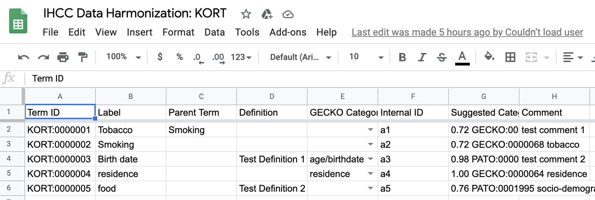

# How to register your Data Dictionary with the International HundredK+ Cohorts Consortium (IHCC)

Email of the IHCC data harmonization team: `ihcc-browser@googlegroups.com`

## Initial submission

1. Download the [data dictionary registration template](https://github.com/IHCC-cohorts/data-harmonization/raw/master/data/ihcc-data-dictionary-registration-template.xlsx). It is an Excel Workbook in XLSX format, containing the following three sheets:
   1. *Instructions*. Please read this table carefully before you continue.
   1. *Metadata*. Contains basic metadata about your data dictionary, such as name, description and license.
   1. *Terminology*. Contains the terms of your data dictionary, alongside a few optional columns.
1. Follow the instructions in the *Instructions* sheet.
1. Email the completed sheet with the following pieces of information to IHCC data harmonization team (see top of the page):
   - An email address connected to a Google account. This does not have to be a gmail address, but you will need a Google account to be able to map your data dictionary to GECKO. *Note:* If you are not permitted, or willing, to use a Google account, please tell us that in the email, so that we can send you alternative instructions.
   - The *short capital letter ID* for your data dictionary. Examples are: GE (Genomic England), VZ (Vukuzazi), Golestan Cohort Study (GCS).
1. You will receive further instructions soon after you have submitted your data dictionary.

## Mapping

1. You should have received a link to a Google Spreadsheet.
   - If you do not have a Google account, you will have received alternative instructions and can ignore the following.
1. Open the Google Spreadsheet. You will see the same three sheets you have already seen in the Excel Spreadsheet (Instructions, Metadata, Terminology).
1. Click on the *Terminology* sheet. You should see a table similar to this one:

1. Beyond the columns you are already familiar with from the `Instructions` sheet (`Term ID`, `Parent Term`, `Definition`, `Internal ID` and `Comment`), you can find now three additional columns:
   - `Term ID`: This is the automatically assigned numeric identifier to the term you have specified. Do _not_ edit this column.
   - `GECKO category`: This is the column you will use to actually perform the mapping. It will contain drop-down menus with the terms of the GECKO ontology (for more information about GECKO see [here](http://www.obofoundry.org/ontology/gecko.html)). The terms in the drop down are generally sorted alphabetically, but a few *high probability mappings* are sorted to the top. If a mapping suggestion is near certain, it is set as the default (conversely, if there is no near-certain mapping, no term will be selected by default).
   - `Suggested Categories`: This column contains a breakdown of the suggested mappings. It can be entirely *ignored* by the data dictionary maintainer, but it is sometimes useful to understand how confident the automated mapping system was about a suggested GECKO term.
1. For all terms in your data dictionary, select a suitable GECKO category. If none exists, leave blank. Optional: If you use GitHub, we would highly appreciate a [ticket](https://github.com/IHCC-cohorts/GECKO/issues) for unmapped terms on the GECKO repository (simply create a new issue saying that you did not find suitable categories for them).
1. When you are happy with your mappings, send an email to the IHCC data harmonization team (see top of the page), telling us the name of your data dictionary and that you are done.
1. *Thank you very much!* We will take it from here. Once the data dictionary mappings are available on our site, you will receive a confirmation via email.