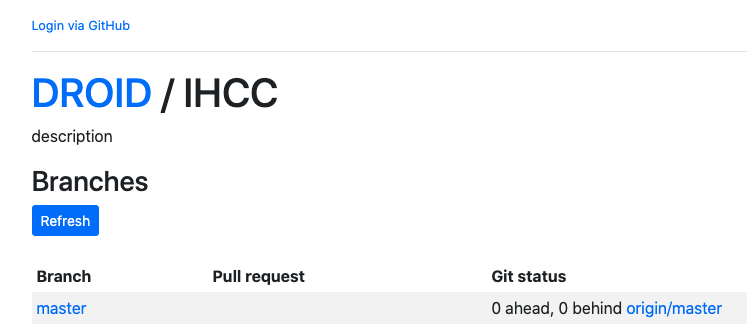
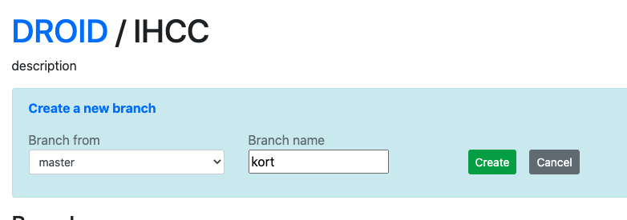
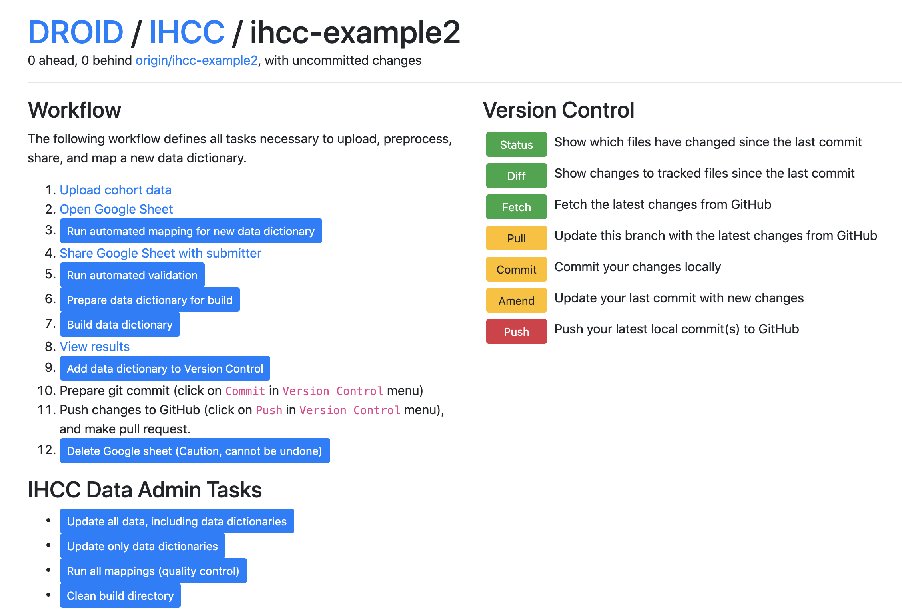
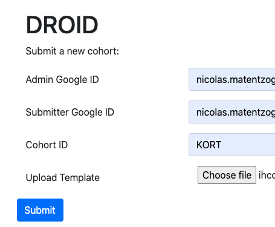

# Instructions for the IHCC Data Steward

The data steward has three main responsibilities:

1. Working with the *data dictionary maintainer* to [incorporate a new data dictionary](#incorporating-a-new-data-dictionary)
2. [Ensuring the quality and consistency of existing mappings over time](#ensuring-the-quality-and-consistency-of-mappings-over-time)
3. [Updating data dictionaries](#updating-an-existing-data-dictionary) in response to changes to the schema or the data dictionaries themselves

## Incorporating a new data dictionary

### Initial Communication
1. Point the *data dictionary maintainer* to the instructions [here](DataDictionaryMapping.md).
1. Wait for the submission email containing the excel Workbook described in the instructions above. Before you start with the next steps, make sure you have:
   1. A valid *email connected with a google account* for the submitter. If the data submitter is unable to provide a Google account email, please see [here](AlternativeDataDictionaryMapping.md)
   2. A *short capital letter ID* for their data dictionary

### Prepare data dictionary automated mapping
1. Go to https://droid.ontodev.com/IHCC (see for some general DROID tips [below](#general-droid-tips)).
1. Make sure you are logged in. If you are, you will see your name in the top left corner; if you are not, you will see the Login via GitHub link like this:

1. If you were redirected to the "Available Projects" Overview, click on the [IHCC](https://droid.ontodev.com/IHCC) project.
1. In the IHCC `Branches` overview, click "Refresh", and then do one of the following two options:
   - If you want to continue working on a data dictionary you have previously created, click on the `Checkout` button next to it.
   - If you want to create a new data dictionary, click "Create new". Then, in the `Branch from` window select `master`, and then enter a `Branch name`, ideally corresponding to the name of the data dictionary (its good practice for IHCC to use lower-case branch names only). Then click `Create`. Here in example where we are creating the fictional data dictionary `example`:

1. In the branches view, you will see your new branch along with a red `Delete` button next to it. This means that the branch is available and ready to be viewed. Click on the name of the branch (in the running example, that is `kort`). This will bring you to the IHCC branch control page, which will look something like that:

1. Click on `Upload cohort data`, the first step in the IHCC Data Workflow.
1. Fill in the form that is popping up in a new Window. The filled in form should look something like this:

1. Click `Submit`. Once the upload is complete, you will see a page with two links (`Open Google Sheet` and `Back`). We will close this for now, to go back to the branch control page with the workflow. Note: *You are only able to do this once in your branch. If you feel like you made a mistake, simply go back to the start, delete the branch you created and start over.*
1. At this point, it makes sense to look at the Google sheet once to catch obvious errors (bad looking labels, incomplete dictionary etc). There is a fair bit of quality control running, but it makes sense to err on the cautious side.
1. Next, click on `Run automated mapping for new data dictionary`. This will trigger the automated mapping process. In the console below, you will see the progress of the mapping. When the process is finished, the data dictionary will have been uploaded along with the mapping suggestions into. After refreshing a few times, you will hopefully see a Green confirmation pronouncing `Success`. Else, you will have to read the log file and look out for [typical errors](TypicalDataDictionaryBuildErrors.md)
1. You can now share the data dictionary with the submitter by clicking `Share Google Sheet with submitter`.

### Supporting the mapping phase
1. When you receive word from the data dictionary maintainer that they have finished their mappings, you can `Run automated validation`. If everything is correct, you should, after a while, see the green `Success` message. 
   * Watch out: `Success` does not mean that there are no errors! It only means that the validation process ran successfully. Read the short log file for potential problems, and communicate them back to the data dictionary providers. DROID will have added validation errors into the Google sheet itself, so they can be fixed by the data dictionary maintainers. 
   * Tip: There is a tiny delay between edits performed on a Google sheet and the sheets being synced properly. Its generally a good idea to leave around 10 seconds between an edit to a Google sheet and running a `DROID` command.
1. This phase may require a bit of back and forth with the *data dictionary providers* until the validation is passed.

### Finalizing the mapping.
1. If everything went with the previous step and the validation has passed, click `Prepare data dictionary for build`.
1. If the preparation terminated correctly, you can now `Build data dictionary`. This will produce the OWL files and other related datasets (including the updated dataset for the IHCC browser!).
1. You are now ready to `Commit` the changes and `Push` the changes to GitHub. If asked to create a pull request, do that.
1. Ask a colleague to review your pull request on GitHub. If you could a positive review, merge the pull request and you are done. 
1. Don't forget to delete the branch on GitHub, and perhaps even on DROID!

## Ensuring the quality and consistency of mappings over time 
From time to time, it makes sense to run do a health check on existing mappings, because of the possibilities of them diverging over time. For example, a new data dictionary could be mapping the same term against a different GECKO category, either because of a difference in opinion, or because the GECKO term did not exist when the one of the two data dictionaries was mapped. To do a QC analysis:

1. Go to https://droid.ontodev.com/IHCC (see for some general DROID tips [below](#general-droid-tips)).
1. Same as before, create a new branch, naming it something like `qc-oct2020` or similar.
1. Click on the branch, and then, in the section `IHCC Data Admin Tasks`, click on `Run all mappings (quality control)`.
1. If everything went well, this process will result in a success. If not, follow the instructions in the log - perhaps a few of the previous mappings are now outdated and need to be changed (see next section, "Updating an existing data dictionary").

## Updating an existing data dictionary
There are currently no tools to support edits to data dictionaries easily. Please follow the following steps (you may have to ask for help from your IHCC tech goto-person)

1. `git clone` the [data harmonization repository](https://github.com/IHCC-cohorts/data-harmonization).
1. The source of truth for any data dictionary and their mappings is in the `templates` directory, for example `templates/ge.tsv`. Edit this file using, for example Excel.
1. In your console, run `cd` to the `data-harmonization` project directory, then type `make all`. This will rebuild all data dictionaries, including your recent changes.
1. Inspect the diff, commit the changes to a branch, push and create a pull request.
1. Ask for a review from another IHCC member, then proceed as usual. If you know how, make sure editing the TSV with Excel causes only a small diff, reflecting your changes. Else, it is possible Excel saved the file with somehow wrong settings.

## General DROID tips

1. `DROID` is the tool you will be using to manage most of the workflows around incorporating new data dictionary mappings.
1. `DROID` is essentially a thin layer that allows us execute commands and run typical `git` commands in a simple-to-use interface.
1. General tips:
   - Remember to hit the `refresh` button when you have kicked off a process to determine if the process is still ongoing.
   - No process you execute as part of the IHCC pipeline should ever take more than 5 min. It is unlikely a process could get stuck, but it would, you can `Cancel` it when not seeing any progress after waiting 5 min.
1. Nothing you do in the DROID UI *except for the red Push button on the left* can actually do anything to the GitHub repository that holds our data. The `delete` button in the [branches overview](https://droid.ontodev.com/IHCC), for example, only deletes a copy of a branch; not the actual branch on GitHub.
1. If clicking on a link does not open the tabs as documented by the process above, try switching of any Ad blockers you have running in your browser.
1. A list of typical errors that can occur during the whole process can be found [here](TypicalDataDictionaryBuildErrors.md).
1. One of the central components underlying DROID is GNU make, a system to, in essence, build files in a systematic way. One typical message that often confuses new users of `make`, but one we would not expect you to encounter using DROID, is `nothing to be done for X`, where `X` is usually the name of a file. This means that the file and all its dependencies have already been build correctly and you can proceed to the next step. If you use `make` outside of DROID in the command line, you can add a `-B` at the end of your command to invalid all previous attempts to build the file and force rebuilding it (and all its dependencies), for example. `make test.txt -B`.
